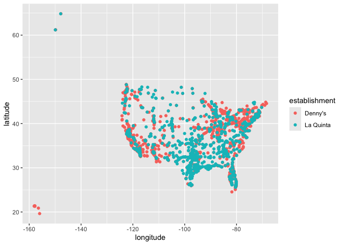
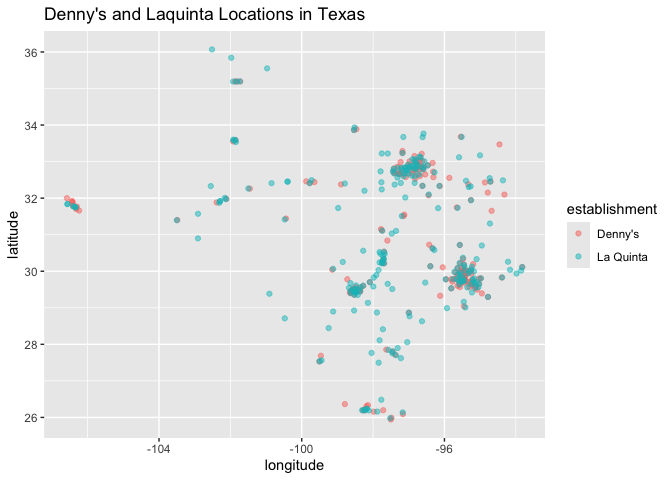

Lab 04 - La Quinta is Spanish for next to Denny’s, Pt. 1
================
Noah Booker
03/18/25

### Load packages and data

``` r
library(tidyverse) 
##library(dsbox) 
```

To install dsbox, it wanted me to update R. Instead I just downloaded
the two datasets manually.

``` r
states <- read_csv("data/states.csv")
```

### Exercise 1

``` r
load("~/Documents/Documents/Studies/School/WFU/DS4P/Lab_4/data/dennys.rda")
glimpse(dennys)
```

    ## Rows: 1,643
    ## Columns: 6
    ## $ address   <chr> "2900 Denali", "3850 Debarr Road", "1929 Airport Way", "230 …
    ## $ city      <chr> "Anchorage", "Anchorage", "Fairbanks", "Auburn", "Birmingham…
    ## $ state     <chr> "AK", "AK", "AK", "AL", "AL", "AL", "AL", "AL", "AL", "AL", …
    ## $ zip       <chr> "99503", "99508", "99701", "36849", "35207", "35294", "35056…
    ## $ longitude <dbl> -149.8767, -149.8090, -147.7600, -85.4681, -86.8317, -86.803…
    ## $ latitude  <dbl> 61.1953, 61.2097, 64.8366, 32.6033, 33.5615, 33.5007, 34.206…

The dennys dataset has 1,643 observations of 6 variables. The
observations represent Denny’s restaurants and the variables represent
various characteristics of each restaurant’s location (address, city,
state, zipcode, longitude, and latitude).

### Exercise 2

``` r
load("~/Documents/Documents/Studies/School/WFU/DS4P/Lab_4/data/laquinta.rda")
glimpse(laquinta)
```

    ## Rows: 909
    ## Columns: 6
    ## $ address   <chr> "793 W. Bel Air Avenue", "3018 CatClaw Dr", "3501 West Lake …
    ## $ city      <chr> "\nAberdeen", "\nAbilene", "\nAbilene", "\nAcworth", "\nAda"…
    ## $ state     <chr> "MD", "TX", "TX", "GA", "OK", "TX", "AG", "TX", "NM", "NM", …
    ## $ zip       <chr> "21001", "79606", "79601", "30102", "74820", "75254", "20345…
    ## $ longitude <dbl> -76.18846, -99.77877, -99.72269, -84.65609, -96.63652, -96.8…
    ## $ latitude  <dbl> 39.52322, 32.41349, 32.49136, 34.08204, 34.78180, 32.95164, …

The laquinta dataset has 909 observations of 6 variables. The
observations represent La Quinta locations and the variables represent
various characteristics of each hotel’s location (address, city, state,
zipcode, longitude, and latitude).

### Exercise 3

According to their website, there are La Quinta locations outside the
US. There are locations in Canada, Mexico, China, New Zealand, Turkey,
United Arab Emirates, Chile, Colombia, and Ecuador.

Denny’s website only allows me to either search locations using a city,
zipcode, or my current location or to browse US locations. So, I am
ucertain whether there are Denny’s locations outisde the US.

### Exercise 4

To examine the datasets to see whether La Quinta and Denny’s have
location outside of the US I could use something like dennys %\>%
distinct(state) for each dataset. Because they both have variables for
the state of the location, I could use the distinct function to visually
examine all the states that appear in the datasets to see if any seem
like non-US states.

### Exercise 5

``` r
dennys %>%
  filter(!(state %in% states$abbreviation))
```

    ## # A tibble: 0 × 6
    ## # ℹ 6 variables: address <chr>, city <chr>, state <chr>, zip <chr>,
    ## #   longitude <dbl>, latitude <dbl>

This filter gives a tibble with 0 rows, indicating that there are no
Denny’s locations in the dataset in states other than US states.

### Exercise 6

``` r
dennys <- dennys %>% 
  mutate(country = "United States")
```

Created a country variable for the dennys dataset.

### Exercise 7

``` r
laquinta %>%
  filter(!(state %in% states$abbreviation))
```

    ## # A tibble: 14 × 6
    ##    address                                  city  state zip   longitude latitude
    ##    <chr>                                    <chr> <chr> <chr>     <dbl>    <dbl>
    ##  1 Carretera Panamericana Sur KM 12         "\nA… AG    20345    -102.     21.8 
    ##  2 Av. Tulum Mza. 14 S.M. 4 Lote 2          "\nC… QR    77500     -86.8    21.2 
    ##  3 Ejercito Nacional 8211                   "Col… CH    32528    -106.     31.7 
    ##  4 Blvd. Aeropuerto 4001                    "Par… NL    66600    -100.     25.8 
    ##  5 Carrera 38 # 26-13 Avenida las Palmas c… "\nM… ANT   0500…     -75.6     6.22
    ##  6 AV. PINO SUAREZ No. 1001                 "Col… NL    64000    -100.     25.7 
    ##  7 Av. Fidel Velazquez #3000 Col. Central   "\nM… NL    64190    -100.     25.7 
    ##  8 63 King Street East                      "\nO… ON    L1H1…     -78.9    43.9 
    ##  9 Calle Las Torres-1 Colonia Reforma       "\nP… VE    93210     -97.4    20.6 
    ## 10 Blvd. Audi N. 3 Ciudad Modelo            "\nS… PU    75010     -97.8    19.2 
    ## 11 Ave. Zeta del Cochero No 407             "Col… PU    72810     -98.2    19.0 
    ## 12 Av. Benito Juarez 1230 B (Carretera 57)… "\nS… SL    78399    -101.     22.1 
    ## 13 Blvd. Fuerza Armadas                     "con… FM    11101     -87.2    14.1 
    ## 14 8640 Alexandra Rd                        "\nR… BC    V6X1…    -123.     49.2

This code gives states in the laquinta dataset which are not US states.
I can google the cities/addresses/state abbreviations to figure out the
country.

### Exercise 8

``` r
laquinta <- laquinta %>%
  mutate(country = case_when(
    state %in% state.abb ~ "United States",
    state %in% c("ON", "BC") ~ "Canada",
    state == "ANT" ~ "Colombia",
    state %in% c("AG", "QR", "CH", "NL", "VE", "PU", "SL") ~ "Mexico",
    state == "FM" ~ "Honduras"
  ))
laquinta <- laquinta %>%
  filter(country == "United States")
```

Added country variable and assigned appropriate values. Then filtered to
include only US locations (which made the previous part feel like a
waste of time…but good exercise I suppose).

### Exercise 9

Which states have the most and fewest Denny’s locations? What about La
Quinta? Is this surprising? Why or why not?

``` r
dennys %>% 
  count(state) %>% 
  arrange(desc(n))
```

    ## # A tibble: 51 × 2
    ##    state     n
    ##    <chr> <int>
    ##  1 CA      403
    ##  2 TX      200
    ##  3 FL      140
    ##  4 AZ       83
    ##  5 IL       56
    ##  6 NY       56
    ##  7 WA       49
    ##  8 OH       44
    ##  9 MO       42
    ## 10 PA       40
    ## # ℹ 41 more rows

``` r
dennys %>% 
  count(state) %>% 
  arrange(n)
```

    ## # A tibble: 51 × 2
    ##    state     n
    ##    <chr> <int>
    ##  1 DE        1
    ##  2 DC        2
    ##  3 VT        2
    ##  4 AK        3
    ##  5 IA        3
    ##  6 NH        3
    ##  7 SD        3
    ##  8 WV        3
    ##  9 LA        4
    ## 10 MT        4
    ## # ℹ 41 more rows

``` r
laquinta %>% 
  count(state) %>% 
  arrange(desc(n))
```

    ## # A tibble: 48 × 2
    ##    state     n
    ##    <chr> <int>
    ##  1 TX      237
    ##  2 FL       74
    ##  3 CA       56
    ##  4 GA       41
    ##  5 TN       30
    ##  6 OK       29
    ##  7 LA       28
    ##  8 CO       27
    ##  9 NM       19
    ## 10 NY       19
    ## # ℹ 38 more rows

``` r
laquinta %>% 
  count(state) %>% 
  arrange(n)
```

    ## # A tibble: 48 × 2
    ##    state     n
    ##    <chr> <int>
    ##  1 ME        1
    ##  2 AK        2
    ##  3 NH        2
    ##  4 RI        2
    ##  5 SD        2
    ##  6 VT        2
    ##  7 WV        3
    ##  8 WY        3
    ##  9 IA        4
    ## 10 MI        4
    ## # ℹ 38 more rows

California has the most Denny’s, followed by Texas. This isn’t
surprising because they’re big states. Delaware has only one Denny’s and
DC and Vermont both have two. I don’t know what to think about that.
Texas has the most LaQuintas (big state, makes sense), followed by
Florida for a not-close-at-all second (237 vs. 74). Maine has only one
LaQuinta followd by a handful of other northern states with only two.

### Exercise 10

Which states have the most Denny’s locations per thousand square miles?
What about La Quinta?

``` r
dennys_densities <- dennys %>%
  count(state) %>%
  inner_join(states, by = c("state" = "abbreviation")) %>% 
  mutate(dennys_density = n/(area/1000)) %>% 
  arrange(desc(dennys_density))
laquinta_densities <- laquinta %>%
  count(state) %>%
  inner_join(states, by = c("state" = "abbreviation")) %>% 
  mutate(laquintas_density = n/(area/1000)) %>% 
  arrange(desc(laquintas_density))
dennys_densities
```

    ## # A tibble: 51 × 5
    ##    state     n name                     area dennys_density
    ##    <chr> <int> <chr>                   <dbl>          <dbl>
    ##  1 DC        2 District of Columbia     68.3         29.3  
    ##  2 RI        5 Rhode Island           1545.           3.24 
    ##  3 CA      403 California           163695.           2.46 
    ##  4 CT       12 Connecticut            5543.           2.16 
    ##  5 FL      140 Florida               65758.           2.13 
    ##  6 MD       26 Maryland              12406.           2.10 
    ##  7 NJ       10 New Jersey             8723.           1.15 
    ##  8 NY       56 New York              54555.           1.03 
    ##  9 IN       37 Indiana               36420.           1.02 
    ## 10 OH       44 Ohio                  44826.           0.982
    ## # ℹ 41 more rows

``` r
laquinta_densities
```

    ## # A tibble: 48 × 5
    ##    state     n name             area laquintas_density
    ##    <chr> <int> <chr>           <dbl>             <dbl>
    ##  1 RI        2 Rhode Island    1545.             1.29 
    ##  2 FL       74 Florida        65758.             1.13 
    ##  3 CT        6 Connecticut     5543.             1.08 
    ##  4 MD       13 Maryland       12406.             1.05 
    ##  5 TX      237 Texas         268596.             0.882
    ##  6 TN       30 Tennessee      42144.             0.712
    ##  7 GA       41 Georgia        59425.             0.690
    ##  8 NJ        5 New Jersey      8723.             0.573
    ##  9 MA        6 Massachusetts  10554.             0.568
    ## 10 LA       28 Louisiana      52378.             0.535
    ## # ℹ 38 more rows

DC, because it’s so small, has the most Denny’s location per thousand
square miles (even though it only has one). Rhode Island (again, very
small) technically has the most LaQuintas per thousand square miles.

``` r
dennys <- dennys %>%
  mutate(establishment = "Denny's")
laquinta <- laquinta %>%
  mutate(establishment = "La Quinta")
dn_lq <- bind_rows(dennys, laquinta)
ggplot(dn_lq, mapping = aes(
  x = longitude,
  y = latitude,
  color = establishment
)) +
  geom_point()
```

<!-- -->

### Exercise 11

Filter the data for observations in North Carolina only, and recreate
the plot. You should also adjust the transparency of the points, by
setting the alpha level, so that it’s easier to see the overplotted
ones. Visually, does Mitch Hedberg’s joke appear to hold here? (These
visualizations should follow best practices you learned in class, such
as informative titles, axis labels, etc.)

``` r
dn_lq %>% 
  filter(state == "NC") %>% 
    ggplot(dn_lq, mapping = aes(
      x = longitude,
      y = latitude,
      color = establishment
      )) +
    geom_point(alpha = .5) +
    labs(x = "longitude", y = "latitude", title = "Denny's and Laquinta Locations in North Carolina")
```

<!-- -->

The joke appears to hold true for NC. All but one La Quinta is very
close to a Denny’s.

### Exercise 12

Now filter the data for observations in Texas only, and recreate the
plot, with an appropriate alpha level. Visually, does Mitch Hedberg’s
joke appear to hold here?

``` r
dn_lq %>% 
  filter(state == "TX") %>% 
    ggplot(dn_lq, mapping = aes(
      x = longitude,
      y = latitude,
      color = establishment
      )) +
    geom_point(alpha = .5) +
    labs(x = "longitude", y = "latitude", title = "Denny's and Laquinta Locations in Texas")  
```

<!-- -->

There are many more La Quintas which are not right next to a Denny’s in
Texas, but we can see that it still holds true for the most part–La
Quintas and Denny’s definitely cluster together in Texas.
